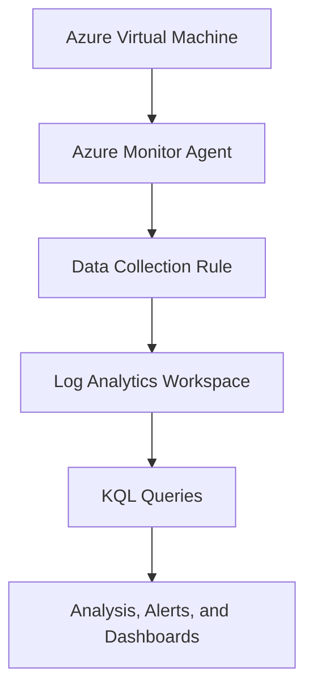

## Overview
Building an Azure VM monitoring environment and learn how Azure Monitor uses metrics, Activity Log, and Log Analytics to monitor Azure resources.

By the end of this lab, I will  understand the difference between:

* **Metrics**
* **Activity Log**
* **Resource logs**
* **Log Analytics**
* **Azure Monitor**

## Scenario
You are an Azure administrator responsible for a virtual machine.

The company wants you to:

* **Monitor VM performance.**
* Investigate administrative activities.
* Centralize monitoring data.
* Determine whether the VM is reporting monitoring data.
* Understand the different monitoring signals available in Azure.

## Architecture
                    Azure Monitor
                       │
          ┌────────────┼────────────┐
          │            │            │
       Metrics    Activity Log   Logs
          │            │            │
          └────────────┼────────────┘
                       │
                Log Analytics
                  Workspace
                       │
                     VM

## Metrics 
Metrics provide numerical measurements of resource performance over time.
Based on the shared screens shot our virtual machine 
* The VM has received a total 2Mib size of incoming traffic over the past 30 min.
*  The VM sent a total of 1.3Mib network data to another destination over the past 30 min
*  About 13.14GB of RAM is available for usage
*  The VM has been currently using 10.25% of its available CPU

## Activity Logs
Activity Log records subscription-level management operations performed on Azure resources.

## Log analytics Workspace 

flowchart TD
    A[Azure Virtual Machine] -->|Heartbeat signal| B[Azure Monitor Agent]
    B --> C[Log Analytics Workspace]
    C --> D[Heartbeat Table]

* Heartbeat measures VM connectivity to the azure monitor agent.
  The query showed the last time the VM checked in with the azure monitor.
